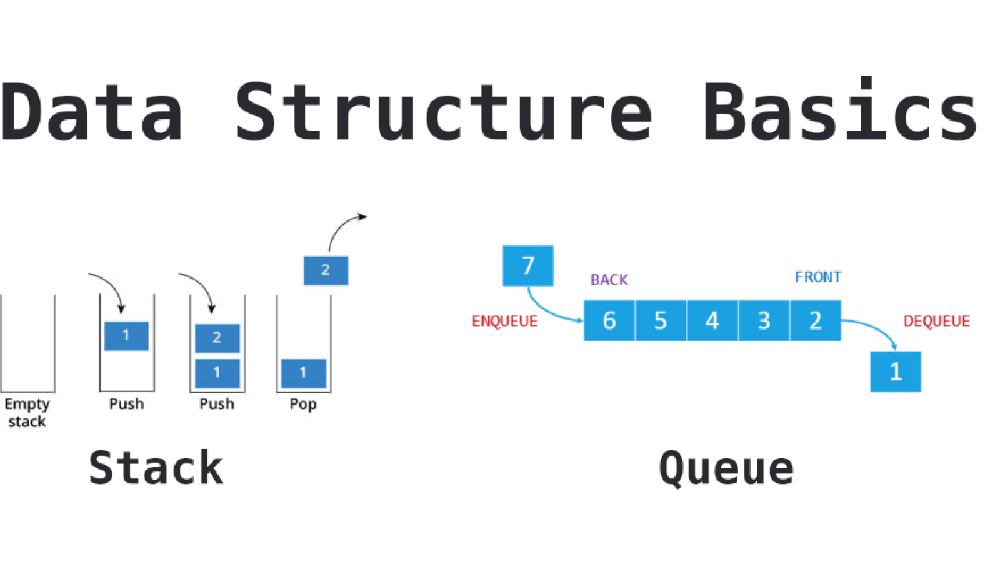

# Monty-Bytecode Interpreter
> The goal of this project is to create an interpreter for monty bytecode files

### The Monty language
Monty 0.98 is a scripting language that is first compiled into Monty byte codes (Just like Python). It relies on a unique stack, with specific instructions to manipulate it.

### Monty byte code files
Files containing Monty byte codes usually have the .m extension. Most of the industry uses this standard but it is not required by the specification of the language. There is not more than one instruction per line. There can be any number of spaces before or after the opcode and its argument:
```
beldine@ubuntu:~/monty$ cat -e bytecodes/000.m
push 0$
push 1$
push 2$
  push 3$
                     pall    $
push 4$
     push 5    $
	push    6        $
pall$
beldine@ubuntu:~/monty$
```
Monty byte code files can contain blank lines (empty or made of spaces only, and any additional text after the opcode or its required argument is not taken into account:
```
beldine@ubuntu:~/monty$ cat -e bytecodes/001.m
push 0 Push 0 onto the stack$
push 1 Push 1 onto the stack$
$
push 2$
  push 3$
                     pall    $
$
$
		             $
push 4$
$
	push 5    $
	     push    6        $
$
pall This is the end of our program. Monty is awesome!$
beldine@ubuntu:~/monty$
```
# The Monty Program
> The aim of the project is to build on understanding of data structures, specifically Stacks and Queues and the use of FIFO and LIFO, by implementing features that run various monty opcodes e.g push, pall, pop, pint etc:
# 

## Installation
Clone this repository:
```
git clone git@github.com:Beldine-Moturi/monty.git
cd monty
```

## Compilation & Output
Your code should be compiled this way:
```
$ gcc -Wall -Werror -Wextra -pedantic -std=c90 *.c -o monty
```
Any output will be printed on stdout. Any error message will be printed on stderr

## Usage
```
$ ./monty file
```
Where file is the path to the file containing Monty byte code.
### Example:
```
beldine@ubuntu:~/monty$ cat -e bytecodes/00.m
push 1$
push 2$
push 3$
pall$
beldine@ubuntu:~/monty$ ./monty bytecodes/00.m
3
2
1
beldine@ubuntu:~/monty$
```

## Technologies used
- Language: C programming language, Bash
- Operating System: Ubuntu 20.04
- Style: Betty
- Compiler: gcc
- Version control: Git

## Author
Beldine Moturi | [Linkedin](https://www.linkedin.com/in/beldine-moturi-00811615a/)